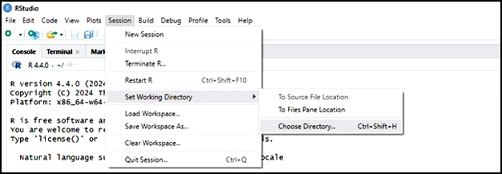
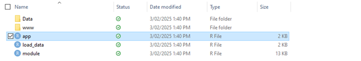

# Build Your Dashboard

If you’ve made it this far, well done! You’re now ready to create a CaRDO dashboard.

**Step 1**. Open RStudio

**Step 2**. Set your working directory (optional)

This is where you want to save your CaRDO dashboard application. You can set your working directory by typing the following command into the RStudio console – *specifying your directory between the quotations.*

- `setwd("/path/to/my/directory")`

Alternatively, you can set the working directory using RStudio's menu system

 
**Step 3**. Install the required R packages.

CaRDO relies on a few essential R packages that are not included with the CaRDO package to function properly. The required packages are:

- DevTools
- Tidyverse
- Plotly
- Markdown

(*If you already have these packages installed, skip to step 4*)

To install packages, you can run the following <a href="code/CaRDO required packages.R" download="Required packages">R code</a>

- Open the file and highlight the code using Ctrl + A, then click the **Run** button at the top right, or press **Ctrl** + **Enter**.

Alternatively, you can copy and paste the following code into your RStudio console.

- `install.packages("devtools")`
- `install.packages("tidyverse")`
- `install.packages("plotly")`
- `install.packages("markdown")`

 
**Step 4** Download and install CaRDO

Paste the following code into your RStudio console.

- `devtools::install_github("https://github.com/CCQResearch/CaRDO")`

 
**Step 5** Create your dashboard

Run CaRDO by pasting the following command into the RStudio console 

- `CaRDO::create_dashboard()`

**Step 6**. Follow the prompts and build you dashboard

- Load your data
- Specify your variables
- Personalise your dashboard

**Step 7**. Run your dashboard application

Once you’ve finished the setup, CaRDO will provide you with a file path (*your R working directory*) to your dashboard application. Follow the path and open the ‘app’ file - this is your CaRDO application! Run the R code by clicking ‘Run App in the top right.

 
You've done it! Start exploring your data by cycling through the available filters. If you run into any problems, or have any questions or concerns, please reach out to us at statistics@cancerqld.org.au.

In the next section we'll guide you through [Publishing] your CaRDO dashboard.

