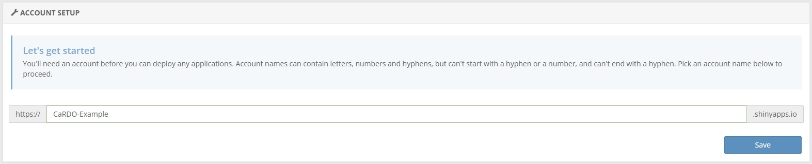

# Publishing

Once you have created a dashboard, you will need to decide how to publish it to allow users to access your dashboard and explore cancer patterns and trends. 

There are several options available, however, we recommend using [shinyapps.io](https://www.shinyapps.io/). ShinyApps.io is a cloud-based hosting platform by [Posit](https://posit.co/) that allows users to easily deploy (within R) and share [Shiny](https://shiny.posit.co/) applications online without requiring server management. It offers multiple pricing tiers, including a free option, making it an accessible choice for individuals and small organizations. 

ShinyApps.io does have security limitations that you should be aware of - ShinyApps.io applications are run in a shared environment. This means that data flows **outside** of your infrastructure to reach the platform. For this reason, we **do not recommend Shinyapps.io for highly sensitive data**. This is why we stress confirming that your data is fit for public consumption **before** publishing your dashboard, and why **CaRDO is specifically designed to handle sensitive data locally**, before it is published. Cancer Council Queensland uses ShinyApps.io to publish our [cancer statistics dashboard](https://cancerqld.org.au/research/queensland-cancer-statistics/queensland-cancer-statistics-online-qcsol/). 

A detailed summary of alternative publishing options and their strengths and limitations is available [here](https://www.appsilon.com/post/r-shiny-deployment)


## Publishing with Shinyapps.io

A detailed guide to setting up a Shinyapps.io account and deploying your dashboard is published [here](https://shiny.posit.co/r/articles/share/shinyapps/). Deployment instructions are also provided upon account setup. Below we provide a summary of the key steps to follow. 

<br>
**Step 1 - rsconnect**

Shinyapps.io requires the latest version of rsconnect. Install the `rsconnect` package by running the following command in your Rstudio console.  

```r
install.packages('rsconnect')
```

Once installed, load `rsconnect` into your R session.

```r
library(rsconnect)
```

<br>
**Step 2 - setup account**

To publish your dashboard through [shinyapps.io](https://www.shinyapps.io/) you will need to sign up for an account. By default, all Shinyapps.io accounts are free with the option to upgrade to a paid service (more on this later).  

The first time you sign in, Shinyapps.io will prompt you to specify an account name. Shinyapps.io uses the account name as the domain name for all of your applications. <span style="color:red;">Important:</span> Shinyapps.io uses the account name you specify as the domain name for all your applications. Meaning, your account name will appear in the URL for your dashboard - for this reason, we recommend making your account name something relevant to your registry or organisation.

```{r, echo=FALSE, out.width='100%', out.extra='style="padding:10px; border:2px solid;"'}

```

<br>
**Step 3 - authorize**

Once you have setup an account, you will need to configure the `rsconnect` package to authorize your account. Shinyapps.io provides instructions on how to do this once you've setup an account. Copy and paste the R code shown in field into your R console and run the code.   


```{r, echo=FALSE, out.width='100%', out.extra='style="padding:10px; border:2px solid;"'}
knitr::include_graphics("images/token.jpeg")
```

<br>
**Step 4 - deploy/publish**

You're now ready to publish your CaRDO dashboard - there are two methods.  

You may run the following code, or alternatively, you may click the publish icon (  ) in the top right corner, next to run.    
```r
rsconnect::deployApp('path/to/your/app')
```

Select the files to be published: Broadly, these will include your app.R file, any other data files, and any image and css (www folder) files. The specific files required for CaRDO are the following:  

- app.R
- CaRDO report template.Rmd
- load_data.R
- module.R
- Data
- www

```{r, echo=FALSE, out.width='100%', out.extra='style="padding:10px; border:2px solid;"'}
knitr::include_graphics("images/publish_files.png")
```

Give your dashboard a name (this will appear in the URL!) and hit Publish - this will take a moment.  

And you're done. Your cancer dashboard is ready to share!

<br>
## Pricing
Shinyapps.io has a range of paid plans to suit different needs when deploying Shiny applications. By default, users can start with the free tier, which allows limited deployment with restrictions on active hours and resources. You can find more details on pricing tiers and available services [here](https://www.shinyapps.io/) 

<br>
Thank you for using CaRDO.

Please reach out to us at statistics@cancerqld.org.au if you have any questions, concerns or feedback - we'd love to hear from you.

<br>
<span style="font-size:25px;">[Updating Your Dashboard]</span>
